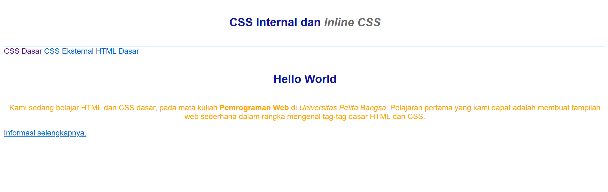
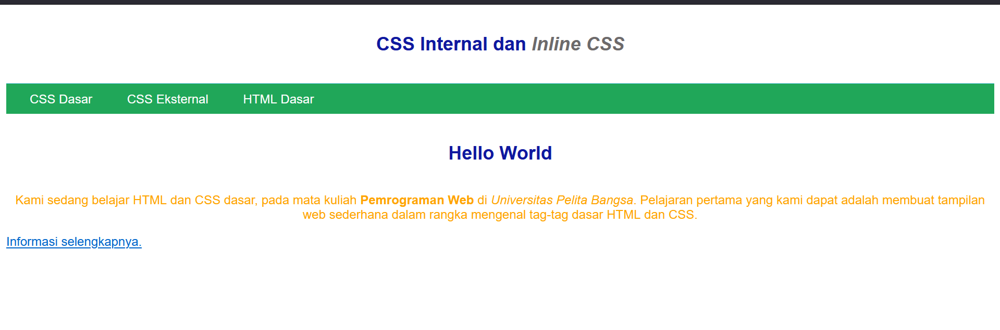

## Nama : Risky HariAdi
## Kelas : TI.20.A1
## Nim : 312010124
## Mata Kuliah : Web Pemrograman

## Pertemuan 3
# Lab2Web

## 1. Membuat Dokumen html

 Disini adalah file html yang belum terdapat file css nya , css internal dan css external serta inline 

 ## 2. Menambahkan css internal 
 
 Css internal adalah css yang file nya terdapat pada dokumen html dengan pendeklarasian style css internal dapat digunakan hanya pada dalam dokumen saja 

 ## 3. Menambahkan css inline
 
 Css inline adalah css yang memiliki prioritas tertinggi dibanding internal dan eksternal

 ## 4 . Membuat css eksternal
 
 Css eksternal adalah css yang file nya terdapat sumber diluar html dengan melalui link akan terhubung dengan css

 ## 5 . Menambahkan css slector
 
 Css slector adalah css yang deklarasiannya dengan id dan class jika id dilambangkan dengan # Sedangkan class menggunakan . 
 
